# Provision an Azure SQL Database

Students will configure basic resources needed to deploy an Azure SQL Database with a Virtual Network Endpoint. Connectivity to the SQL Database will be validated using Azure Data Studio from the lab VM.

As a database administrator for AdventureWorks, you will set up a new SQL Database, including a Virtual Network Endpoint to increase and simplify the security of the deployment. Azure Data Studio will be used to evaluate the use of a SQL Notebook for data querying and results retention.

## Navigate on Azure portal

1. In the lab virtual machine, double click on the Azure portal shortcut on the desktop [https://portal.azure.com](https://portal.azure.com/), and sign in using the Azure **Username** <inject key="AzureAdUserEmail"></inject> and **Password** <inject key="AzureAdUserPassword"></inject>

   

## Create a Virtual Network

1. In the Azure portal home page, select the **left hand menu.**

     

2. In the left navigation pane, click **Virtual Networks**

    

3. Click **+ Create** to open the **Create Virtual Network** page. On the **Basics** tab, complete the following information:

- **Subscription:** Use existing subscription
- **Resource group:** **contoso-rg-<inject key="Deployment-id" enableCopy="false" />** **(1)**
- **Name:** lab02-vnet **(2)**
- **Region:** <inject key="location" enableCopy="false" /> **(3)**

    

4. Click **Next: IP Addresses**.

    

5. Configure the virtual network’s IP range for the Azure SQL database endpoint as follow:

- On the **IP Addresses** tab, leave the defaults for the IPv4 address.
- Click on the **default** subnet link. (Note that the Subnet address range you see might be different.)
   
   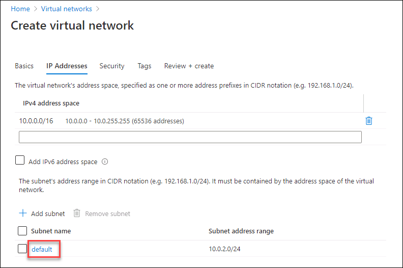

- In the **Edit subnet** Select **Save**.
- Click the **Review + Create** button, review the settings for the new virtual network, and then click **Create**.

## Provision an Azure SQL Database

1. From the Azure Portal, search for “SQL databases” in the search box at the top, then click **SQL databases** from the list of options.

    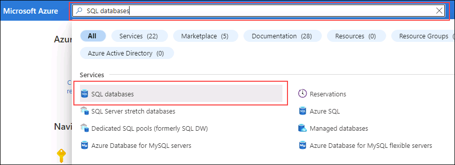

2. On the **SQL databases** blade, select **+ Create**.

    

3. On the **Create SQL Database** page, select the following options on the **Basics** tab and then click **Next: Networking**.

- **Subscription:** Use existing subscription
- **Resource group:** **contoso-rg-<inject key="Deployment-id" enableCopy="false" />**
- **Database Name:** AdventureWorksLT
- **Server:** click on **Create new** link. The **Create SQL Database Server** page will open. Provide the server details as follow:
- **Server name:** dp300-lab-<inject key="Deployment-id" enableCopy="false" /> **(1)**
- **Location:**  <inject key="location" enableCopy="false" /> **(2)**
- **Authentication method:** Use SQL authentication **(3)**
- **Server admin login:** dp300admin **(4)**
- **Password:** dp300P@ssword! **(5)**
- **Confirm password:** dp300P@ssword! **(6)**

  Your **Create SQL Database Server** page should look similar to the one below. Then click **OK (7)**.

     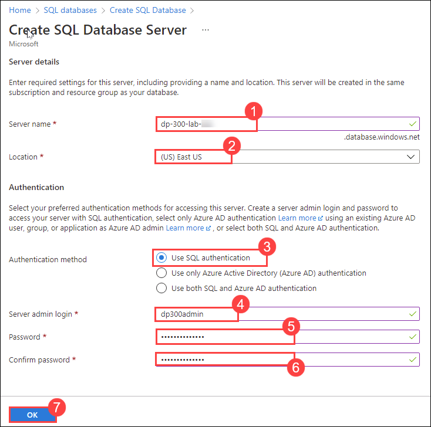

 -  Back to the **Create SQL Database** page, make sure **Want to use Elastic Pool?** is set to **No**.
 -  On the **Compute + Storage** option, click on **Configure database** link. On the **Configure** page, for **Service tier** dropdown, select **Basic**, and then **Apply**.

      >**Note:**  Make note of this server name, and your login information. You will use it in subsequent labs.

4. For the **Backup storage redundancy** option, keep the default value: **Geo-redundant backup storage**.

5. Then click **Next: Networking**.

6. On the **Networking** tab, for **Network Connectivity** option, click the **Private endpoint** radio button.

    

7. Then click the **+ Add private endpoint** link under the **Private endpoints** option.

    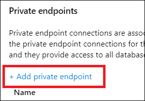

8. Complete the **Create private endpoint** right pane as follows:

- **Subscription:**  Use existing subscription
- **Resource group:**  **contoso-rg-<inject key="Deployment-id" enableCopy="false" />**
- **Location:** <inject key="location" enableCopy="false" />
- **Name:** DP-300-SQL-Endpoint **(1)**
- **Target sub-resource:** SqlServer **(2)**
- **Virtual network:** lab02-vnet **(3)**
- **Subnet:** lab02-vnet/default (10.x.0.0/24) **(4)**
- **Integrate with private DNS zone:** Yes **(5)**
- **Private DNS zone:** keep the default value
- Review settings, and then click **OK**

    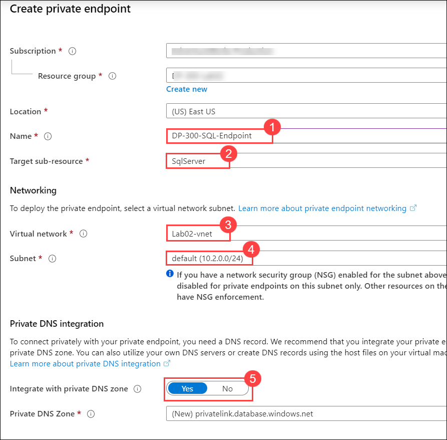

9. The new endpoint will appear on the **Private endpoints** list.

    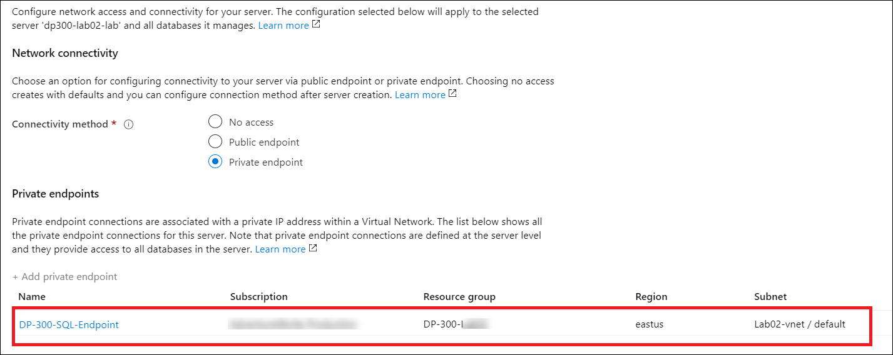

10. Click **Next: Security**, and then **Next: Additional settings**.

11. On the **Additional settings** page, select **Sample** on the **Use existing data** option. Select **OK** if a pop-up message is displayed for the sample database.

    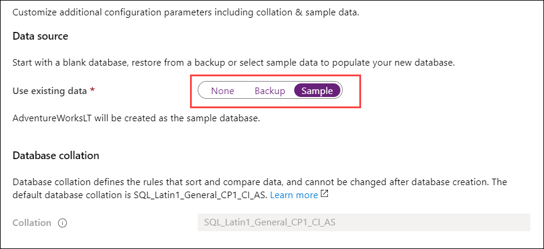

12. Click **Review + Create**.

13. Review the settings before clicking **Create**.

14. Once the deployment is complete, click **Go to resource**.

## Enable access to an Azure SQL Database

1. From the **SQL database** page, select the **Overview** section, and then select the link for the server name in the top section:

    

2. On the SQL servers navigation blade, select **Networking** under the **Security** section.

    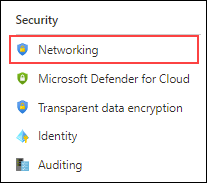

3. On the **Public access** tab, select **Selected networks (1)**, and then check the **Allow Azure services and resources to access this server (2)** property. Click **Save (3)**.

    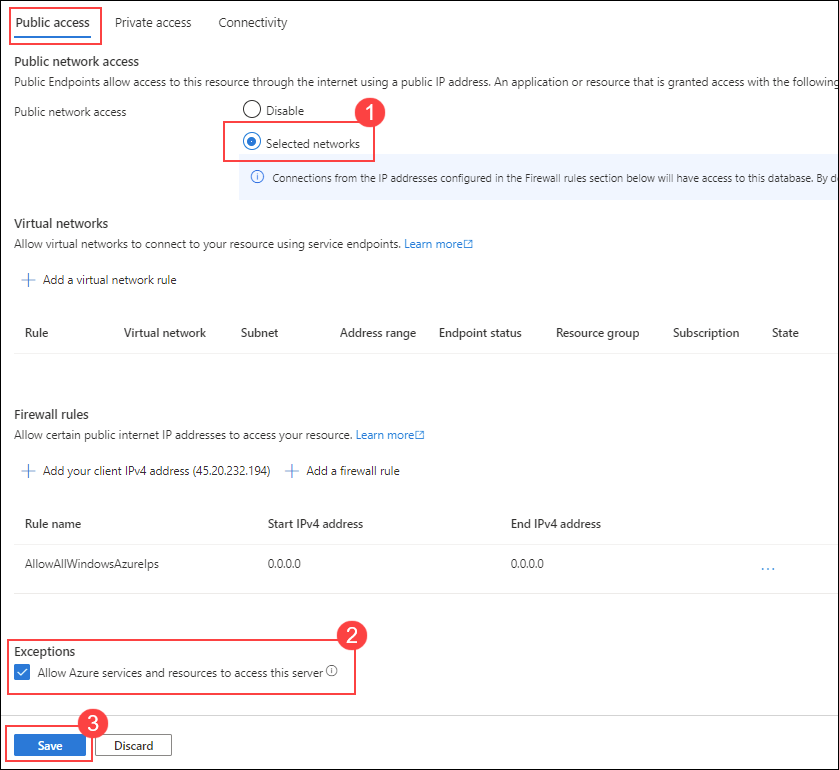

## Connect to an Azure SQL Database in Azure Data Studio

1. Launch Azure Data Studio from the lab virtual machine.

- You may see this pop-up at initial launch of Azure Data Studio. If you receive it, click **Yes (recommended)**

    

2. When Azure Data Studio opens, click the **Connections (1)** button in top left corner, and then **New Connection (2)**.

    

3. In the **Connection** sidebar, fill out the **Connection Details** section with connection information to connect to the SQL database created previously.

- Connection Type: **Microsoft SQL Server (1)**
- Server: Enter the name of the SQL Server created previously. For example: **dp300-lab-<inject key="Deployment-id" enableCopy="false" />.database.windows.net (2)**
- Authentication Type: **SQL Login (3)**
- User name: **dp300admin (4)**
- Password: **dp300P@ssword! (5)**
- Expand the Database drop-down to select **AdventureWorksLT (6)**
- Server group will remain on **&lt;default&gt; (7)**
- Name (optional) can be populated with a friendly name of the database, if desired
- Review settings and click **Connect (8)**

    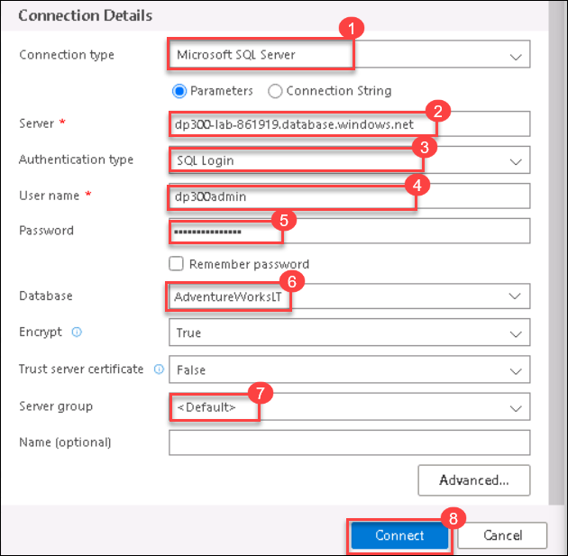

  >**NOTE:** You may be asked to add a firewall rule that allows your client IP access to this server. If you are asked to add a firewall rule, click on **Add account** and login to your Azure account. On **Create new firewall rule** screen, click **OK**.

    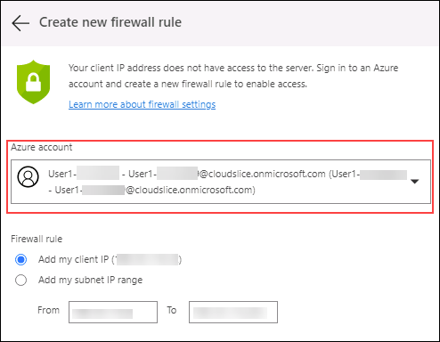

   - Alternatively, you can manually create a firewall rule for your SQL server on Azure portal by navigating to your SQL server, selecting **Networking**, and then selecting **+ Add your client IPv4 address (your IP address)**

   

4. Azure Data Studio will connect to the database, and show some basic information about the database, plus a partial list of objects.

    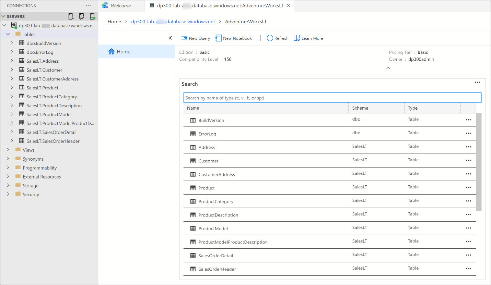

## Query an Azure SQL Database with a SQL Notebook

1. In Azure Data Studio, connected to this lab’s AdventureWorksLT database, click the **New Notebook** button.

    

2. Click the **+Text** link to add a new text box in the notebook

    

>**Note:** Within the notebook you can embed plain text to explain queries or result sets.

3. Enter the text **Top Ten Customers by Order SubTotal**, making it Bold if desired.

    

4. Click the **+ Cell** button, then **Code cell** to add a new code cell at the end of the notebook.

    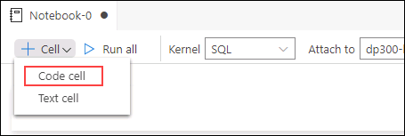

5. Paste the following SQL statement into the new cell:

   ```sql
   SELECT TOP 10 cust.[CustomerID],
   cust.[CompanyName],
   SUM(sohead.[SubTotal]) as OverallOrderSubTotal
   FROM [SalesLT].[Customer] cust
   INNER JOIN [SalesLT].[SalesOrderHeader] sohead
   ON sohead.[CustomerID] = cust.[CustomerID]
   GROUP BY cust.[CustomerID], cust.[CompanyName]
   ORDER BY [OverallOrderSubTotal] DESC
   ```

6. Click on the blue circle with the arrow to execute the query. Note how the results are included within the cell with the query.

7. Click the **+ Cell** button, then **Text cell** to add a new code cell at the end of the notebook.

    

8. Enter the text **Top Ten Ordered Product Categories**, making it Bold if desired.

9. Click the **+ Cell** button again, then **Code cell**, and paste the following SQL statement into the cell:

   ```sql
   SELECT TOP 10 cat.[Name] AS ProductCategory,
   SUM(detail.[OrderQty]) AS OrderedQuantity
   FROM salesLT.[ProductCategory] cat
   INNER JOIN [SalesLT].[Product] prod
   ON prod.[ProductCategoryID] = cat.[ProductCategoryID]
   INNER JOIN [SalesLT].[SalesOrderDetail] detail
   ON detail.[ProductID] = prod.[ProductID]
   GROUP BY cat.[name]
   ORDER BY [OrderedQuantity] DESC
   ```

10. Click on the blue circle with the arrow to execute the query.

11. To run all cells in the notebook and present results, click the **Run all** button in the toolbar.

    

12. Within Azure Data Studio save the notebook from File menu (either Save or Save As) to the **C:\LabFiles\Deploy Azure SQL Database** path (create the folder structure if it does not exist). Make sure the file extension is **.ipynb**(Notebook)

13. Close the tab for the Notebook from inside of Azure Data Studio. From the File Menu, select Open File, and open the notebook you just saved. Observe that query results were saved along with the queries in the notebook.

In this exercise, you've seen how you deploy a Azure SQL Database with a Virtual Network Endpoint. You were also able to connect to the SQL Database you've created using SQL Server Management Studio.
