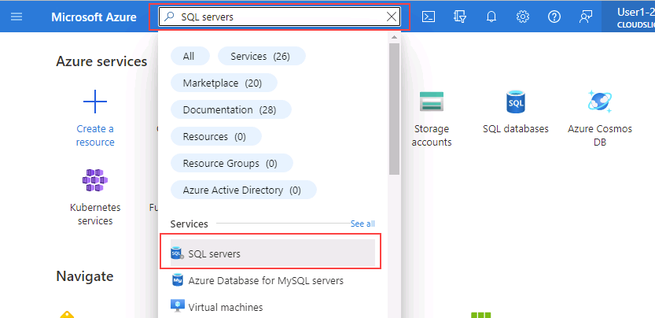

---
lab:
    title: 'Lab 5 – Enable Microsoft Defender for Cloud and Data classification'
    module: 'Implement a Secure Environment for a Database Service'
---

# Implement a Secure Environment

**Estimated Time: 20 minutes**

The students will take the information gained in the lessons to configure and subsequently implement security in the Azure Portal and within the AdventureWorks database.

You have been hired as a Senior Database Administrator help ensure the security of the database environment. These tasks will focus on Azure SQL Database.

**Note:** These exercises ask you to copy and paste T-SQL code. Please verify that the code has been copied correctly, before executing the code.

## Enable Microsoft Defender for SQL and Data Classification

1. From the lab virtual machine, start a browser session and navigate to [https://portal.azure.com](https://portal.azure.com/). Connect to the Portal using the Azure **Username** and **Password** provided on the **Resources** tab for this lab virtual machine.

    

1. From the Azure Portal, search for “SQL servers” in the search box at the top, then click **SQL servers** from the list of options.

    

1. Select the server name **dp300-lab-XXXXXXXX** to be taken to the detail page (you may have a different resource group and location assigned for your SQL server).

    

1. From the main blade of your Azure SQL server, navigate to the **Security** section, and select **Microsoft Defender for Cloud**.

    

    On the **Microsoft Defender for Cloud** page, select **Enable Microsoft Defender for SQL** in case this option is not enabled.

2. After Azure Defender for SQL is successfully enabled, select **Configure** option. You may need to refresh the page to see this option.

    

3. On the **Server Settings** page, make sure the toggle switch under **MICROSOFT DEFENDER FOR SQL** is set to **ON**, and that the **Storage account** name is provided. Enter the Azure account email in the **Send scan reports to**, and select **Save**.

    

4. Navigate to the **AdventureWorksLT** database in the Azure portal by scrolling down in the overview screen for Azure SQL server and select the database name.

    

5. Navigate to the Security section of the main blade for your Azure SQL Database and select **Data Discovery & Classification**.

    

6. On the **Data Discovery & Classification** screen you will see an informational message that reads **We have found 15 columns with classification recommendations**. Select that link.

    

7. On the next **Data Discovery & Classification** screen select the check box next to **Select all**, select **Accepted selected recommendations**, and then select **Save** to save the classifications into the database.

    

