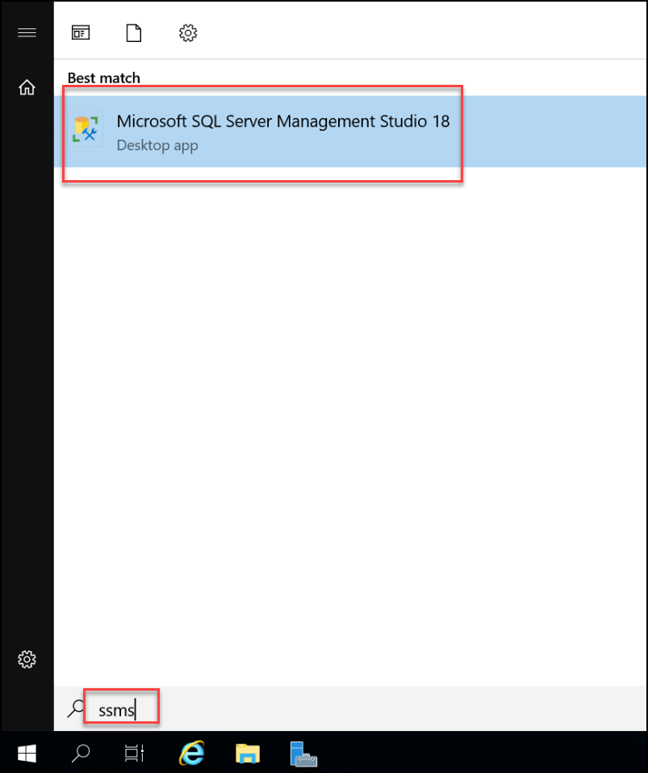
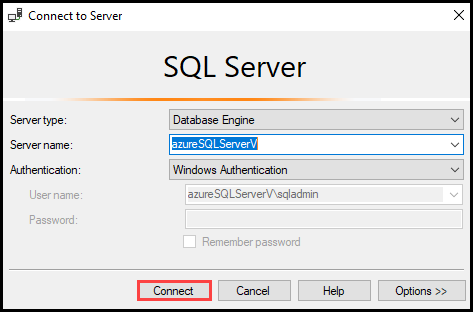
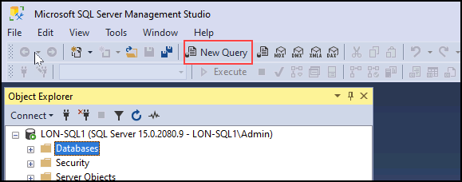

# Detect and correct fragmentation issues

**Estimated Time: 15 minutes**

The students will take the information gained in the lessons to scope out the deliverables for a digital transformation project within AdventureWorks. Examining the Azure portal as well as other tools, students will determine how to utilize native tools to identify and resolve performance related issues. Finally, students will be able to identify fragmentation within the database as well as learn steps to resolve it appropriately.

You have been hired as a database administrator to identify performance related issues and provide viable solutions to resolve any issues found. AdventureWorks has been selling bicycles and bicycle parts directly to consumers and distributors for over a decade. Recently the company has noticed performance degradation in their products that are used to service customer requests. You need to use SQL tools to identify the performance issues and suggest methods to resolve them.

**Note:** These exercises ask you to copy and paste T-SQL code. Please verify that the code has been copied correctly, before executing the code.

## Restore a database

1. Download the database backup file located on **https://github.com/MicrosoftLearning/dp-300-database-administrator/blob/master/Instructions/Templates/AdventureWorks2017.bak** to **C:\LabFiles\Monitor and optimize** path on the Azure SQL VM. 

    
    
**Note:** If the folders **does not exist** then create **LabFiles\Monitor and optimize** in C drive then change the path in **Downloads Settings** to **C:\LabFiles\Monitor and optimize** and download the file.
 
 

2. Select the Windows Start button and type SSMS. Select **Microsoft SQL Server Management Studio 18** from the list.  

    

3. When SSMS opens, notice that the **Connect to Server** dialog will be pre-populated with the default instance name. Select **Connect**.

    

4. Select the **Databases** folder, and then **New Query**.

    

5. In the new query window, copy and paste the below T-SQL into it. Execute the query to restore the database.

    ```sql
    RESTORE DATABASE AdventureWorks2017
    FROM DISK = 'C:\LabFiles\Monitor and optimize\AdventureWorks2017.bak'
    WITH RECOVERY,
          MOVE 'AdventureWorks2017' 
            TO 'C:\LabFiles\Monitor and optimize\AdventureWorks2017.mdf',
          MOVE 'AdventureWorks2017_log'
            TO 'C:\LabFiles\Monitor and optimize\AdventureWorks2017_log.ldf';
    ```

    **Note:** The database backup file name and path should match with what you've downloaded on step 1, otherwise the command will fail.

6. You should see a successful message after the restore is complete.

    

## Investigate index fragmentation

7. Select **New Query**. Copy and paste the following T-SQL code into the query window. Select **Execute** to execute this query.

    ```sql
    USE AdventureWorks2017
    GO
    
    SELECT i.name Index_Name
     , avg_fragmentation_in_percent
     , db_name(database_id)
     , i.object_id
     , i.index_id
     , index_type_desc
    FROM sys.dm_db_index_physical_stats(db_id('AdventureWorks2017'),object_id('person.address'),NULL,NULL,'DETAILED') ps
     INNER JOIN sys.indexes i ON ps.object_id = i.object_id 
     AND ps.index_id = i.index_id
    WHERE avg_fragmentation_in_percent > 50 -- find indexes where fragmentation is greater than 50%
    ```

    This query will report any indexes that have a fragmentation over **50%**. The query should not return any result.

8. Select **New Query**. Copy and paste the following T-SQL code into the query window. Select **Execute** to execute this query.

    ```sql
    USE AdventureWorks2017
    GO
        
    INSERT INTO [Person].[Address]
        ([AddressLine1]
        ,[AddressLine2]
        ,[City]
        ,[StateProvinceID]
        ,[PostalCode]
        ,[SpatialLocation]
        ,[rowguid]
        ,[ModifiedDate])
        
    SELECT AddressLine1,
        AddressLine2, 
        'Amsterdam',
        StateProvinceID, 
        PostalCode, 
        SpatialLocation, 
        newid(), 
        getdate()
    FROM Person.Address;
    
    GO
    ```

    This query will increase the fragmentation level of the Person.Address table and its indexes by adding a large number of new records.

9. Execute the previous query again. Now you should be able to see four highly fragmented indexes.

    

10. Copy and paste the following T-SQL code into the query window. Select **Execute** to execute this query.

    ```sql
    SET STATISTICS IO,TIME ON
    GO
        
    USE AdventureWorks2017
    GO
        
    SELECT DISTINCT (StateProvinceID)
        ,count(StateProvinceID) AS CustomerCount
    FROM person.Address
    GROUP BY StateProvinceID
    ORDER BY count(StateProvinceID) DESC;
        
    GO
    ```

    Click on the **Messages** tab in the result pane of SQL Server Management Studio. Make note of the count of logical reads performed by the query.

    

## Rebuild fragmented indexes

11. Copy and paste the following T-SQL code into the query window. Select **Execute** to execute this query.

    ```sql
    USE AdventureWorks2017
    GO
    
    ALTER INDEX [IX_Address_StateProvinceID] ON [Person].[Address] REBUILD PARTITION = ALL 
    WITH (PAD_INDEX = OFF, 
        STATISTICS_NORECOMPUTE = OFF, 
        SORT_IN_TEMPDB = OFF, 
        IGNORE_DUP_KEY = OFF, 
        ONLINE = OFF, 
        ALLOW_ROW_LOCKS = ON, 
        ALLOW_PAGE_LOCKS = ON)
    ```

12. Execute the query below to confirm that the **IX_Address_StateProvinceID** index no longer has fragmentation greater than 50%.

    ```sql
    USE AdventureWorks2017
    GO
        
    SELECT DISTINCT i.name Index_Name
        , avg_fragmentation_in_percent
        , db_name(database_id)
        , i.object_id
        , i.index_id
        , index_type_desc
    FROM sys.dm_db_index_physical_stats(db_id('AdventureWorks2017'),object_id('person.address'),NULL,NULL,'DETAILED') ps
        INNER JOIN sys.indexes i ON (ps.object_id = i.object_id AND ps.index_id = i.index_id)
    WHERE i.name = 'IX_Address_StateProvinceID'
    ```

    Comparing the results we can see the fragmentation dropped from 81% to 0.

13. Re-execute the select statement from the previous section. Make note of the logical reads in the **Messages** tab of the **Results** pane in Management Studio. Was there a change from the number of logical reads encountered before you rebuilt the index?

    ```sql
    SET STATISTICS IO,TIME ON
    GO
        
    USE AdventureWorks2017
    GO
        
    SELECT DISTINCT (StateProvinceID)
        ,count(StateProvinceID) AS CustomerCount
    FROM person.Address
    GROUP BY StateProvinceID
    ORDER BY count(StateProvinceID) DESC;
        
    GO
    ```

Because the index has been rebuilt, it will now be as efficient as possible and the logical reads should reduce. You have now seen that index maintenance can have an effect on query performance.

In this exercise, you've learned how to rebuild index and analyze logical reads to increase query performance.
