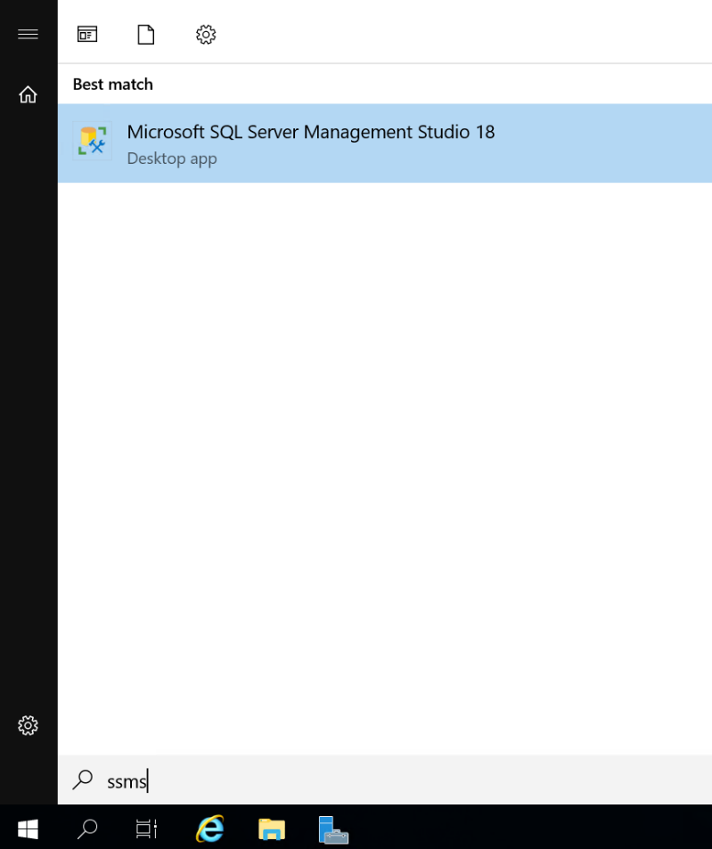
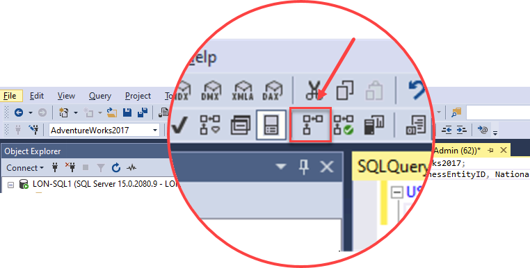
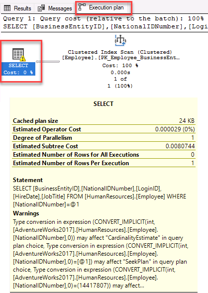
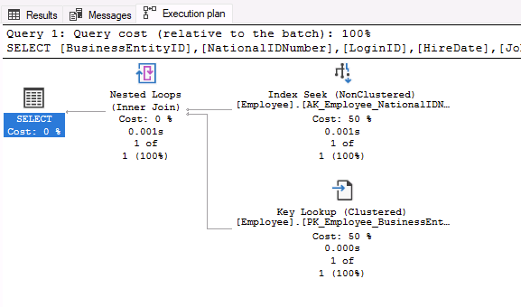
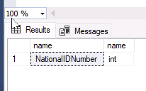
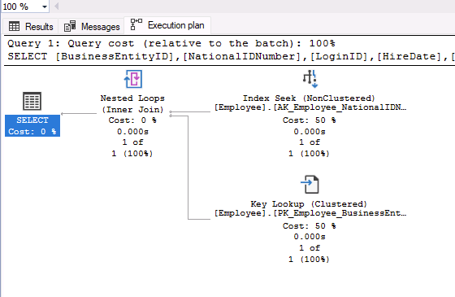

# Identify database design issues

**Estimated Time: 15 minutes**

The students will take the information gained in the lessons to scope out the deliverables for a digital transformation project within AdventureWorks. Examining the Azure portal as well as other tools, students will determine how to utilize native tools to identify and resolve performance related issues. Finally, students will be able to evaluate a database design for problems with normalization, data type selection and index design.

You have been hired as a database administrator to identify performance related issues and provide viable solutions to resolve any issues found. AdventureWorks has been selling bicycles and bicycle parts directly to consumers and distributors for over a decade. Your job is to identify issues in query performance and remedy them using techniques learned in this module.

**Note:** These exercises ask you to copy and paste T-SQL code. Please verify that the code has been copied correctly, before executing the code.

## Restore a database

1. Download the database backup file located on **https://github.com/MicrosoftLearning/dp-300-database-administrator/blob/master/Instructions/Templates/AdventureWorks2017.bak** to **C:\LabFiles\Monitor and optimize** path on Azure SQL VM created in Lab1 (create the folder structure if it does not exist).

    

1. Select the Windows Start button and type SSMS. Select **Microsoft SQL Server Management Studio 18** from the list.  

    

1. When SSMS opens, notice that the **Connect to Server** dialog will be pre-populated with the default instance name. Select **Connect**.

    

1. Select the **Databases** folder, and then **New Query**.

    

1. In the new query window, copy and paste the below T-SQL into it. Execute the query to restore the database.

    ```sql
    RESTORE DATABASE AdventureWorks2017
    FROM DISK = 'C:\LabFiles\Monitor and optimize\AdventureWorks2017.bak'
    WITH RECOVERY,
          MOVE 'AdventureWorks2017' 
            TO 'C:\LabFiles\Monitor and optimize\AdventureWorks2017.mdf',
          MOVE 'AdventureWorks2017_log'
            TO 'C:\LabFiles\Monitor and optimize\AdventureWorks2017_log.ldf';
    ```

    **Note:** The database backup file name and path should match with what you've downloaded on step 1, otherwise the command will fail.

1. You should see a successful message after the restore is complete.

    

## Examine the query and identify the problem

1. Select **New Query**. Copy and paste the following T-SQL code into the query window. Select **Execute** to execute this query.

    ```sql
    USE AdventureWorks2017
    GO
    
    SELECT BusinessEntityID, NationalIDNumber, LoginID, HireDate, JobTitle
    FROM HumanResources.Employee
    WHERE NationalIDNumber = 14417807;
    ```

1. Select **Include Actual Execution Plan** icon as shown below before running the query or press **CTRL+M**. This will cause the execution plan to be displayed when you execute the query. Select **Execute** to execute this query again.

    

1. Navigate to the execution plan, by selecting the **Execution plan** tab in the results panel. In the execution plan, mouse over the `SELECT` operator. You will notice a warning message identified by an exclamation point in a yellow triangle as shown below. Identify what the warning message tells you.

    

## Identify ways to fix the warning message

The *[HumanResources].[Employee]* table structure is shown in the follow data definition language (DDL) statement. Review the fields that are used in the previous SQL query against this DDL, paying attention to their types.

```sql
CREATE TABLE [HumanResources].[Employee](
     [BusinessEntityID] [int] NOT NULL,
     [NationalIDNumber] [nvarchar](15) NOT NULL,
     [LoginID] [nvarchar](256) NOT NULL,
     [OrganizationNode] [hierarchyid] NULL,
     [OrganizationLevel] AS ([OrganizationNode].[GetLevel]()),
     [JobTitle] [nvarchar](50) NOT NULL,
     [BirthDate] [date] NOT NULL,
     [MaritalStatus] [nchar](1) NOT NULL,
     [Gender] [nchar](1) NOT NULL,
     [HireDate] [date] NOT NULL,
     [SalariedFlag] [dbo].[Flag] NOT NULL,
     [VacationHours] [smallint] NOT NULL,
     [SickLeaveHours] [smallint] NOT NULL,
     [CurrentFlag] [dbo].[Flag] NOT NULL,
     [rowguid] [uniqueidentifier] ROWGUIDCOL NOT NULL,
     [ModifiedDate] [datetime] NOT NULL
) ON [PRIMARY]
```

1. According to the warning message presented in the execution plan, what change would you recommend?

    1. Identify what field is causing the implicit conversion and why. 
    1. If you review the query:

        ```sql
        SELECT BusinessEntityID, NationalIDNumber, LoginID, HireDate, JobTitle
        FROM HumanResources.Employee
        WHERE NationalIDNumber = 14417807;
        ```

        You'll note that the value compared to the *NationalIDNumber* column in the `WHERE` clause is compared as a number, since **14417807** isn't in a quoted string. 

        After examining the table structure you will find the *NationalIDNumber* column is using the `NVARCHAR` data type and not an `INT` data type. This inconsistency causes the database optimizer to implicitly convert the number to a `NVARCHAR` value, causing additional overhead to the query performance by creating a suboptimal plan.

There are two approaches we can implement to fix the implicit conversion warning. We will investigate each of them in the next steps.

### Change the code

1. How would you change the code to resolve the implicit conversion? Change the code and rerun the query.

    Remember to turn on the **Include Actual Execution Plan** (**CTRL+M**) if it is not already on. 

    In this scenario, just adding a single quote on each side of the value changes it from a number to a character format. Keep the query window open for this query.

    Run the updated SQL query:

    ```sql
    SELECT BusinessEntityID, NationalIDNumber, LoginID, HireDate, JobTitle
    FROM HumanResources.Employee
    WHERE NationalIDNumber = '14417807';
    ```

    

    **Note:** the warning message is now gone, and the query plan has improved. Changing the `WHERE` clause so that the value compared to the *NationalIDNumber* column matches the column's data type in the table, the optimizer was able to get rid of the implicit conversion.

### Change the data type

1. We can also fix the implicit conversion warning by changing the table structure.

    To attempt to fix the index, copy and paste the query below into a new query window, to change the column's data type. Attempt to execute the query, by selecting **Execute** or pressing <kbd>F5</kbd>.

    ```sql
    ALTER TABLE [HumanResources].[Employee] ALTER COLUMN [NationalIDNumber] INT NOT NULL;
    ```

    Changing the *NationalIDNumber* column data type to INT would solve the conversion issue. However, this change introduces another issue that as a database administrator you need to resolve.

    

    The *NationalIDNumber* column is part of an already existing nonclustered index, the index has to be rebuilt/recreated in order to change the data type. **This could lead to extended downtime in production, which highlights the importance of choosing the right data types in your design.**

1. In order to resolve this issue, copy and paste the code below into your query window and execute it by selecting **Execute**.

    ```sql
    USE AdventureWorks2017
    GO
    
    --Dropping the index first
    DROP INDEX [AK_Employee_NationalIDNumber] ON [HumanResources].[Employee]
    GO

    --Changing the column data type to resolve the implicit conversion warning
    ALTER TABLE [HumanResources].[Employee] ALTER COLUMN [NationalIDNumber] INT NOT NULL;
    GO

    --Recreating the index
    CREATE UNIQUE NONCLUSTERED INDEX [AK_Employee_NationalIDNumber] ON [HumanResources].[Employee]( [NationalIDNumber] ASC );
    GO
    ```

1. Alternatively, you can run the query below to confirm that the data type was successfully changed.

    ```sql
    SELECT c.name, t.name
    FROM sys.all_columns c INNER JOIN sys.types t
    	ON (c.system_type_id = t.user_type_id)
    WHERE OBJECT_ID('[HumanResources].[Employee]') = c.object_id
        AND c.name = 'NationalIDNumber'
    ```
    
    
    
1. Now let's check the execution plan. Rerun the original query without the quotes.

    ```sql
    USE AdventureWorks2017
    GO

    SELECT BusinessEntityID, NationalIDNumber, LoginID, HireDate, JobTitle
    FROM HumanResources.Employee
    WHERE NationalIDNumber = 14417807;
    ```

    

    Examine the query plan, and note that you can now use an integer to filter by *NationalIDNumber* without the implicit conversion warning. The SQL query optimizer can now generate and execute the most optimal plan.

In this exercise, you've learned how to identify query problems caused by implicit data type conversions, and how to fix it to improve the query plan.
