---
lab:
    title: 'Lab 12 – Create a CPU status alert for a SQL Server'
    module: 'Automate database tasks for Azure SQL'
---

# Create a CPU status alert for a SQL Server on Azure

**Estimated Time: 30 minutes**

You have been hired as a Senior Data Engineer to help automate day to day operations of database administration. This automation is to help ensure that the databases for AdventureWorks continue to operate at peak performance as well as provide methods for alerting based on certain criteria.

## Create an alert when a CPU exceeds an average of 80 percent

1. In the search bar at the top of the Azure portal, type **SQL**, and select **SQL databases**. Select the **AdventureWorksLT** database name listed.

    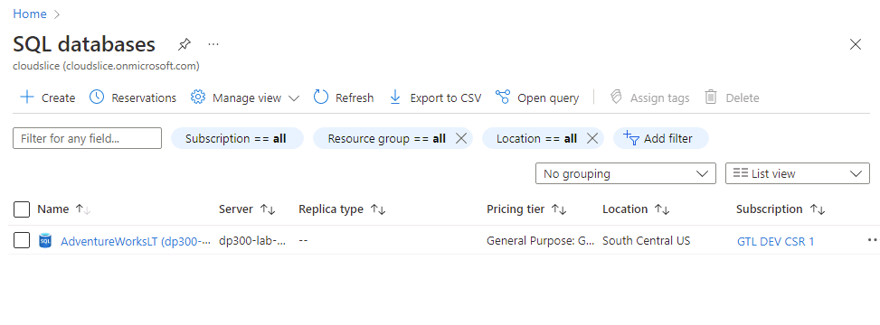

1. On the main blade for the **AdventureWorksLT** database, navigate down to the monitoring section. Select **Alerts**.

    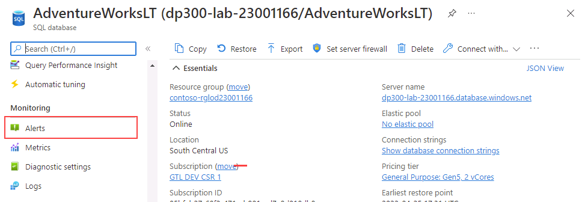

1. Select **Create alert rule**.

    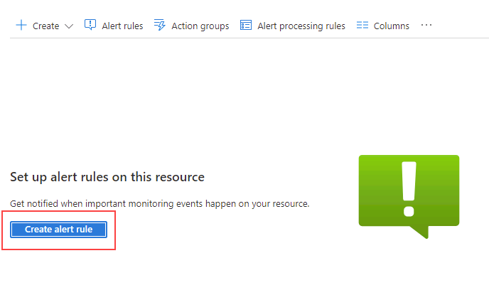

1. In the **Select a signal** slide out, select **CPU percentage**.

    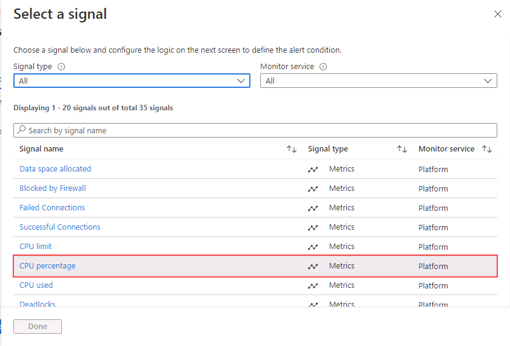

1. In the **Configure signal** slide out, select **Static** for the **Threshold** property. Then check that the **Operator** property is **Greater than**, the **Aggregation** type is **Average**. Then in **Threshold value** enter a value of **80**. Select **Done**.

    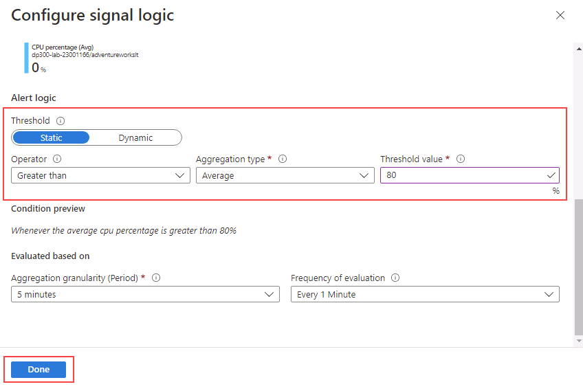

1. Select the **Actions** tab.

    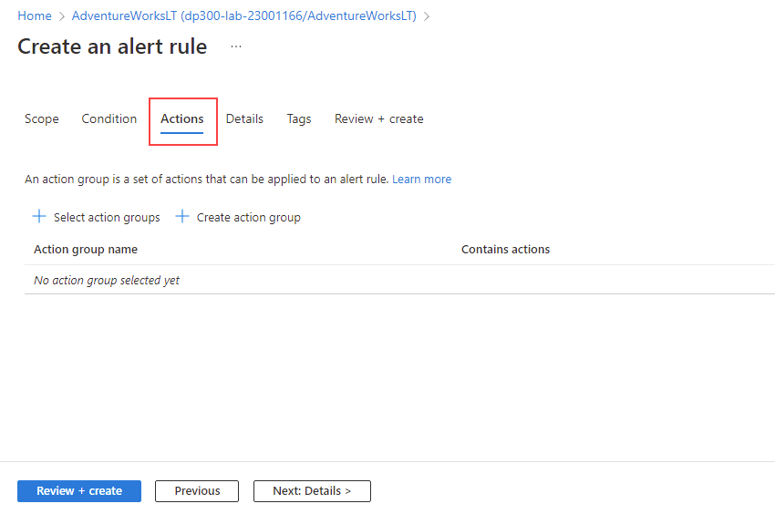

1. In the **Actions** tab, select **Create action group**.

    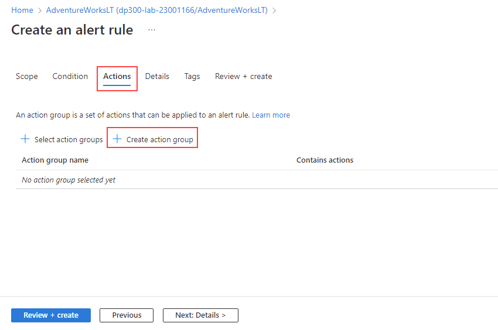

    On the **Action Group** screen, type **emailgroup** in the **Action group name** field, and then select **Next: Notifications**.

    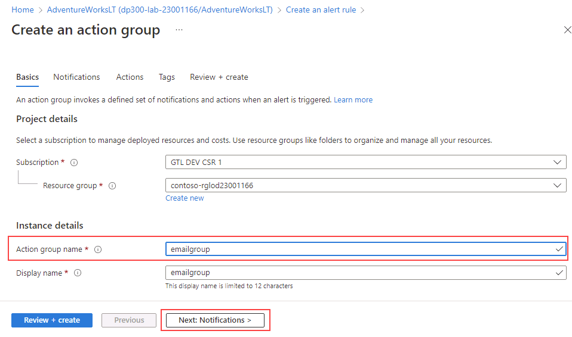

1. On the **Notifications** tab, enter the following information:

    - **Notification type:** Email/SMS message/Push/Voice
        - **Note:** When you select this option, a Email/SMS message/Push/Voice flyout will appear. Check the Email property and type the Azure username you signed in with.
    - **Name:** DemoLab

    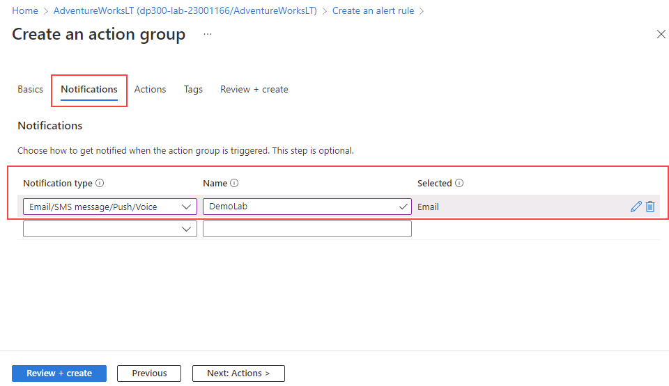

1. Select **Review + create**, then select **Create**.

    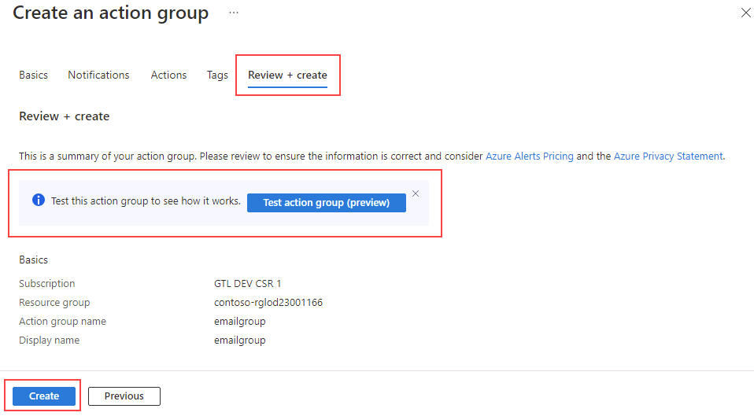

    **Note:** Before you select **Create**, you can also select **Test action group (preview)** to test the Alert.

1. An email like this is sent to the email address that you entered, once the rule is created.

    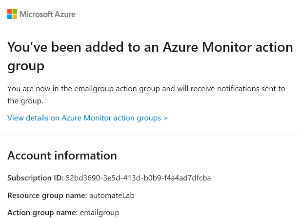

    With the alert in place, if the CPU usage on average exceeds 80%, an email like this is sent.

    

Alerts can send you an email or call a web hook when some metric (for example database size or CPU usage) reaches a threshold you define. You've just seen how you can easily configure Alerts for Azure SQL Databases.
