# Create a CPU status alert for a SQL Server on Azure

You have been hired as a Senior Data Engineer to help automate day to day operations of database administration. This automation is to help ensure that the databases for AdventureWorks continue to operate at peak performance as well as provide methods for alerting based on certain criteria.

## Create an alert when a CPU exceeds an average of 80 percent

1. In the search bar at the top of the Azure portal, type **SQL**, and select **SQL databases**. Select the **AdventureWorksLT** database name listed.

   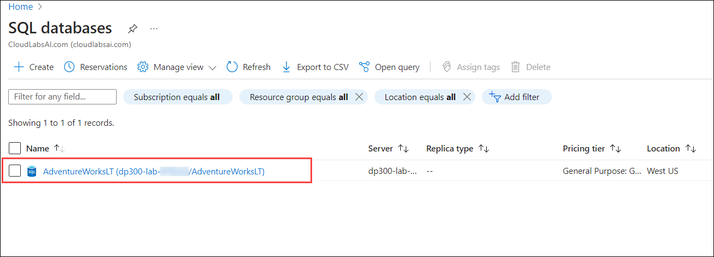

2. On the main blade for the **AdventureWorksLT** database, navigate down to the monitoring section. Select **Alerts**.

   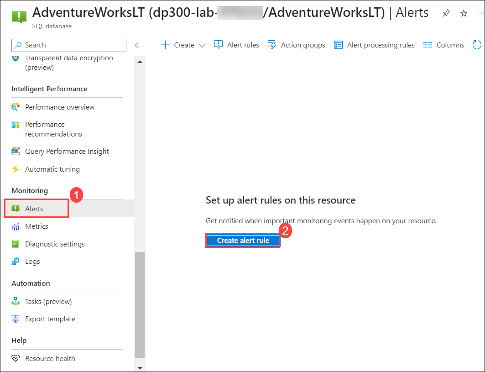

3. Select **Create alert rule**.

   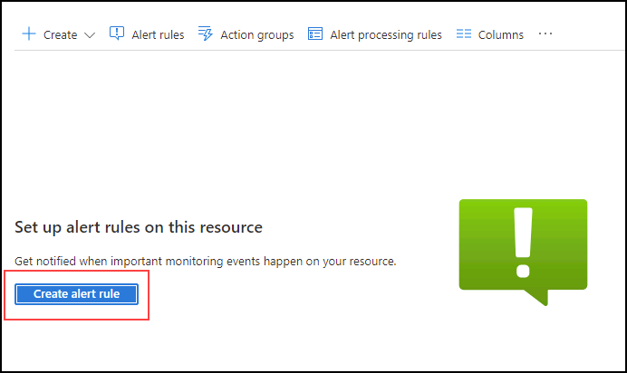

4. In the **Select a signal** slide out, select **CPU percentage**.

   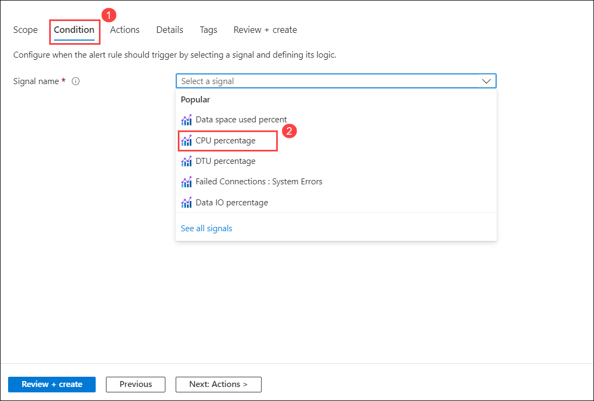

5. In the **Create an alert rule** slide out, select **Static (1)** for the **Threshold** property. Then check that the **Aggregation** type is **Average (2)**, the **Operator** property is **Greater than (3)** Then in **Threshold value** enter a value of **80 (4)**. Select **Next:Actions (5)**.

    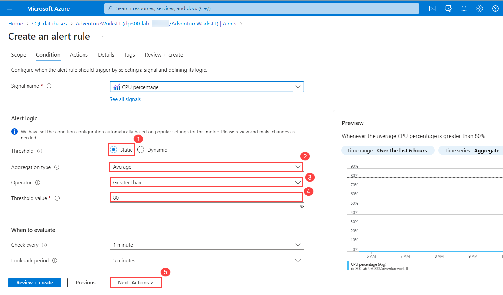

6. In the **Actions** tab, select **Create action group**.

    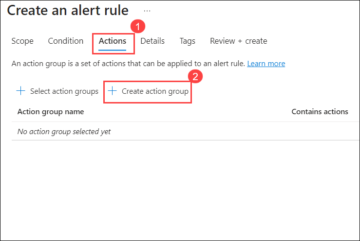

7. On the **Create action group** screen, type **emailgroup** in the **Action group name** field, and then select **Next: Notifications**.

    

8. On the **Notifications** tab, enter the following information:

    - **Notification type:** Email/SMS message/Push/Voice
       > **Note:** When you select this option, a Email/SMS message/Push/Voice flyout will appear. Check the Email property and type the proper email address, you can also use your personal email so that you can receive the notifications as shown in the last steps.
     - Click on **OK**
    - **Name:** DemoLab 
    - Select **Review + create**, then select **Create**.
        >**Note:** Wait till action group created successfully then move to next step.

    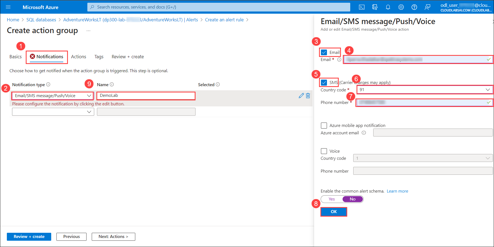
    
9. On the **Create an alert rule** screen, select **Details** tab, enter Alert rule name as **emailrule (1)**, then select **Review + create (2)**.
    
    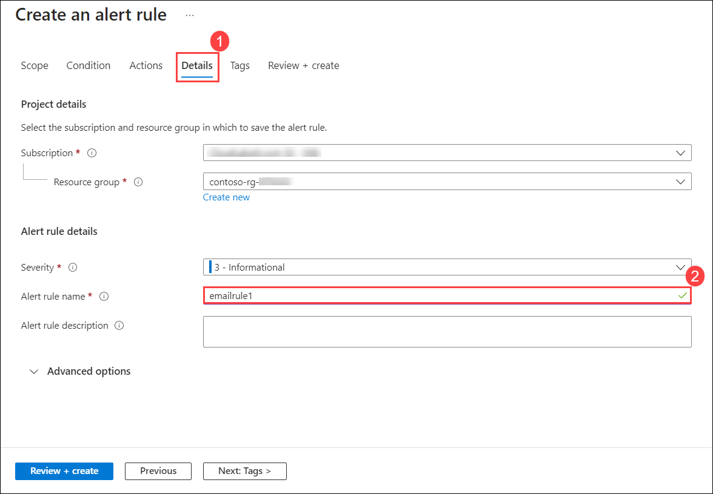

10. On the **Review + create** tab, Select **Create**.

    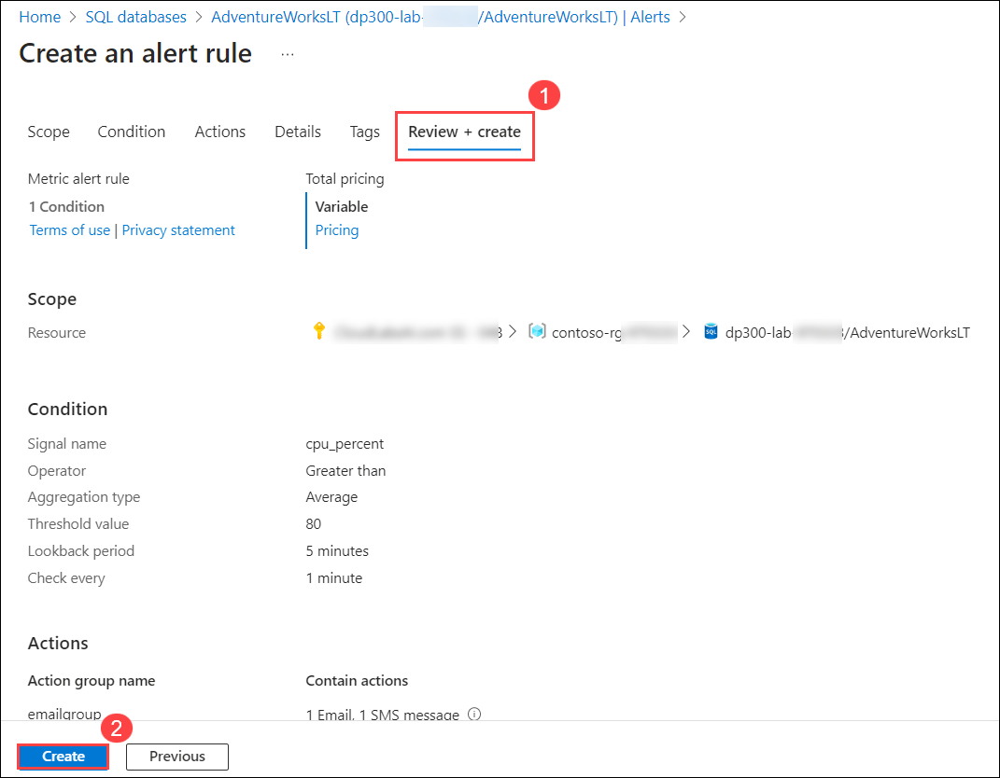
    
11. An email like this is sent to the email address that you entered, once the rule is created.

    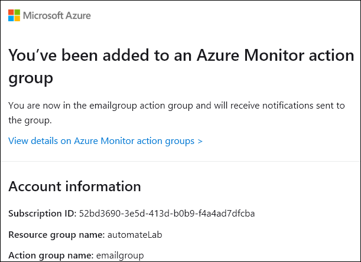

    With the alert in place, if the CPU usage on average exceeds 80%, an email like this is sent.

    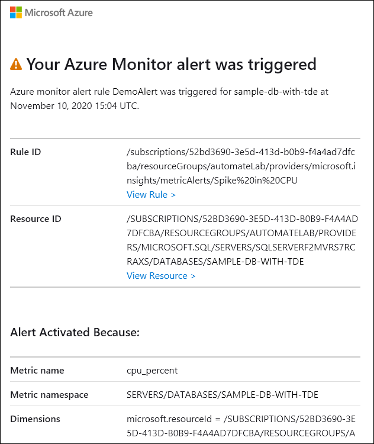
    
    > **Congratulations!** You have successfully completed this task. Please validate your progress by clicking on (...) icon from upper right corner of lab guide section and switch to Lab Validation tab and then click on Validate button for the respective task.

Alerts can send you an email or call a web hook when some metric (for example database size or CPU usage) reaches a threshold you define. You've just seen how you can easily configure alerts for Azure SQL Databases.
