---
lab:
    title: 'Lab 13 – Deploy an automation runbook to automatically rebuild indexes'
    module: 'Automate database tasks for Azure SQL'
---

# Deploy an automation runbook to automatically rebuild indexes

**Estimated Time: 30 minutes**

You have been hired as a Senior Database Administrator to help automate day to day operations of database administration. This automation is to help ensure that the databases for AdventureWorks continue to operate at peak performance as well as provide methods for alerting based on certain criteria. AdventureWorks utilizes SQL Server in both Infrastructure as a Service (IaaS) and Platform as a Service (PaaS) offerings.

## Create an Automation Account

1. From the lab virtual machine, start a browser session and navigate to [https://portal.azure.com](https://portal.azure.com/). Connect to the Portal using the Azure **Username** and **Password** provided on the **Resources** tab for this lab virtual machine.

    

1. In the Azure portal in the search bar type *automation* and then select **Automation Accounts** from the search results, and then select **+ Create**.

    

1. On the **Create an Automation Account** page, enter the information below, and then select **Review + Create**.

    - **Resource Group:** starting with *automateLab*
    - **Name:** autoAccount
    - **Location:** Use the default.

    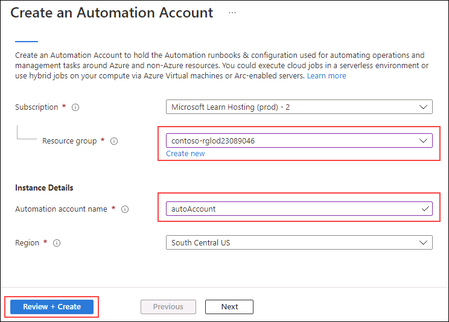

1. On the review page, select **Create**.

    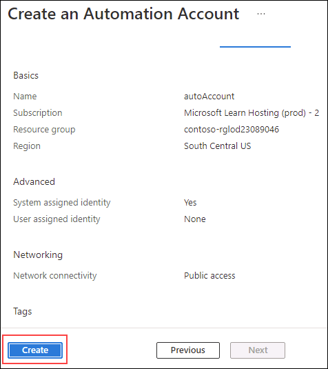

    > [!NOTE]
    > Your automation account should be created in around three minutes.

## Connect to an existing Azure SQL Database

1. In the Azure portal, navigate to your database by searching for **sql databases**.

    

1. Select the SQL database **AdventureWorksLT**.

    

1. On the main section for your SQL Database page, select **Query editor (preview)**.

    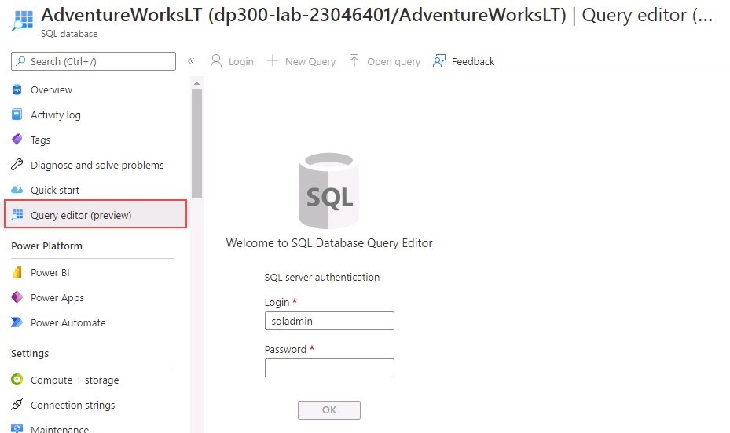

1. You will be prompted for credentials to sign in to your database. Use this credential:

    - **Login:** sqladmin
    - **Password:** P@ssw0rd01

1. You should receive the following error message:

    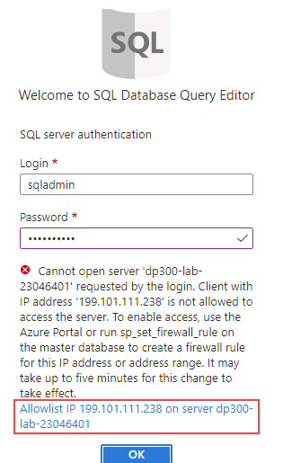

1. Select the **Allowlist IP ...** link provided at the end of the error message shown above. This will automatically add your client IP as a firewall rule entry for your SQL Database.

    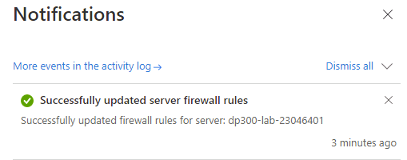

1. Return to the Query editor, and select **OK** to sign in to your database.

1. Open a new tab in your browser and navigate to the GitHub page to access the [**AdaptativeIndexDefragmentation**](https://github.com/microsoft/tigertoolbox/blob/master/AdaptiveIndexDefrag/usp_AdaptiveIndexDefrag.sql) script. Then, select **Raw**.

    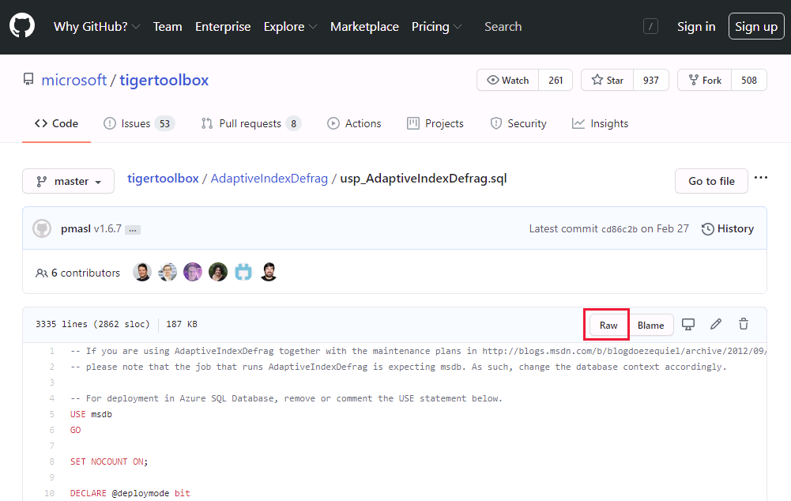

    This will provide the code in a format where you can copy it. Select all of the text ( <kbd>CTRL</kbd> + <kbd>A</kbd> ) and copy it to your clipboard ( <kbd>CTRL</kbd> + <kbd>C</kbd> ).

    >[!NOTE]
    > The purpose of this script is to perform an intelligent defragmentation on one or more indexes, as well as required statistics update, for one or more databases.

1. Close the GitHub browser tab and return to the Azure portal.

1. Paste the text you copied into the **Query 1** pane.

    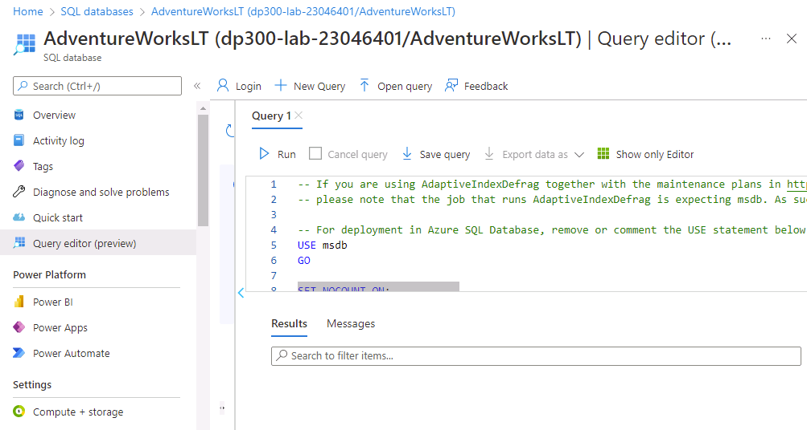

1. Delete `USE msdb` and `GO` on lines 5 and 6 of the query (that are highlighted in the screenshot) , and then select **Run**.

1. Expand the **Stored Procedures** folder to see what was created.

    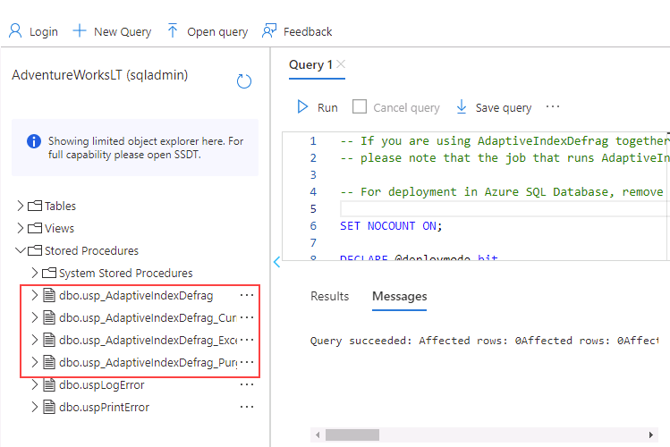

## Configure Automation Account assets

The next steps consist of configuring the assets required in preparation for the runbook creation. Then select **Automation Accounts**.

1. On the Azure portal, in the top search box, type **automation**.

    

1. Select the automation account that you created.

    

1. Select **Modules** from the **Shared Resources** section of the Automation blade. Then select **Browse gallery**.

    

1. Search for **sqlserver** within the Gallery.

    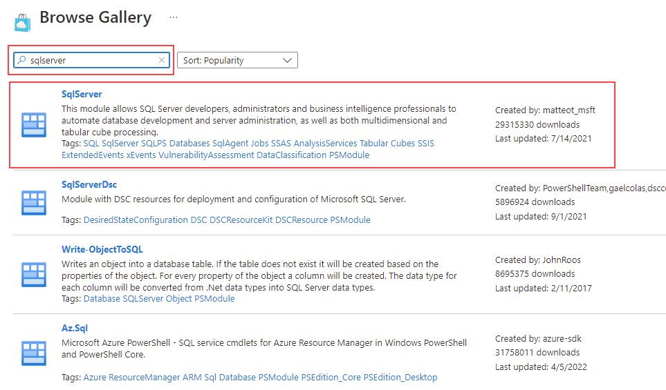

1. Select **SqlServer** which will direct to the next screen, and then select **Select**.

    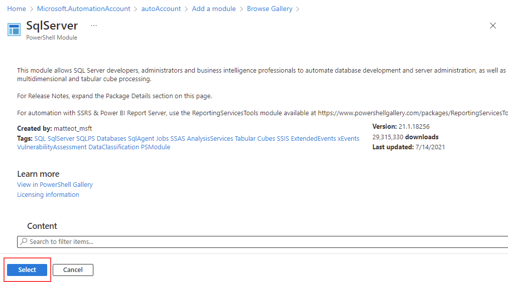

1. On the **Add a module** page, select the latest runtime version available, then select **Import**. This will import the PowerShell module into your Automation account.

    

1. You'll need to create a credential to securely sign in to your database. From the blade for the Automation Account navigate to the **Shared Resources** section and select **Credentials**.

    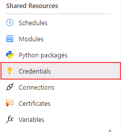

1. Select **+ Add a Credential**, enter the information below, and then select **Create**.

    - Name: **SQLUser**
    - User name: **sqladmin**
    - Password: **P@ssw0rd01**
    - Confirm password: **P@ssw0rd01**

    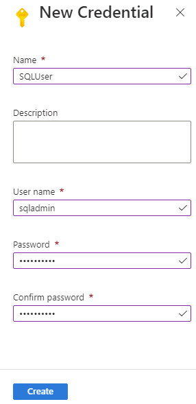

## Create a PowerShell runbook

1. In the Azure portal, navigate to your database by searching for **sql databases**.

    

1. Select the SQL database **AdventureWorksLT**.

    

1. On the **Overview** page copy the **Server name** of your Azure SQL Database as shown below (Your server name should start with *dp300-lab*). You'll paste this in later steps.

    

1. On the Azure portal, in the top search box, type **automation**.

    

1. Select the automation account that you created.

    

1. Scroll to the **Process Automation** section of the Automation account blade, select **Runbooks**, and then **+ Create a runbook**.

    

    >[!NOTE]
    > As we've learned, note that there are two existing runbooks created. These were automatically created during the automation account deployment.

1. Enter the runbook name as **IndexMaintenance** and a runbook type of **PowerShell**. Select the latest runtime version available, then select **Create**.

    

1. Once the runbook has been created, copy and paste the Powershell code snippet below into your runbook editor. On the first line of the script paste in the server name you copied in the steps above. Select **Save**, and then select **Publish**.

    **Note:** Please verify that the code has been copied correctly, before saving the runbook.

    ```powershell
    $AzureSQLServerName = ''
    $DatabaseName = 'AdventureWorksLT'
    
    $Cred = Get-AutomationPSCredential -Name "SQLUser"
    $SQLOutput = $(Invoke-Sqlcmd -ServerInstance $AzureSQLServerName -UserName $Cred.UserName -Password $Cred.GetNetworkCredential().Password -Database $DatabaseName -Query "EXEC dbo.usp_AdaptiveIndexDefrag" -Verbose) 4>&1

    Write-Output $SQLOutput
    ```

    

1. If everything goes well, you should receive a successful message.

    

## Create a schedule for a runbook

Next you will schedule the runbook to execute on a regular basis.

1. Under **Resources** in the left hand navigation of your **IndexMaintenance** runbook, select **Schedules**. Then select **+ Add a schedule**.

    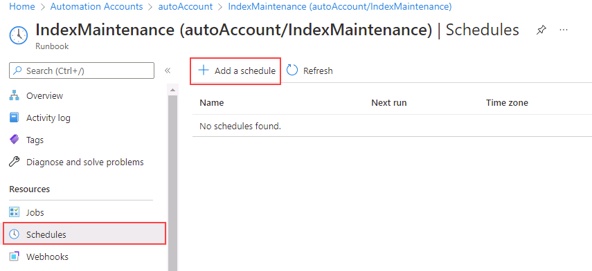

1. Select **Link a schedule to your runbook**.

    

1. Select **+ Add a schedule**.

    

1. Supply a descriptive schedule name and a description if desired.

1. Specify the start time of **4:00AM** of the following day and in the **Pacific Time** time zone. Configure the reoccurrence for every **1** days. Do not set an expiration.

    

1. Select **Create**, and then select **OK**.

1. The schedule is now created and linked to the runbook. Select **OK**.

    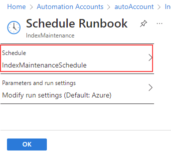

Azure Automation delivers a cloud-based automation, and configuration service that supports consistent management across your Azure and non-Azure environments.

By completing this exercise you've automated the defragging of indexes on a SQL server database to run every day, at 4am.
