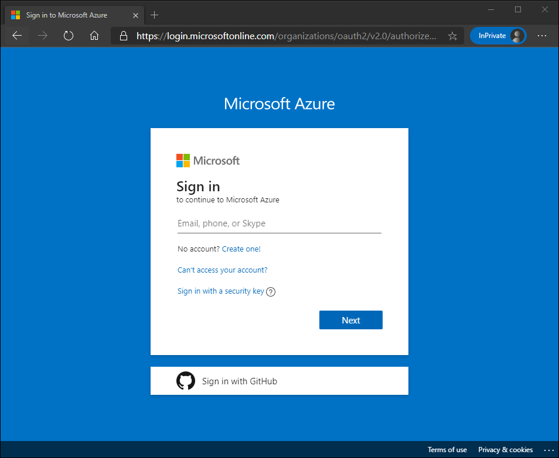
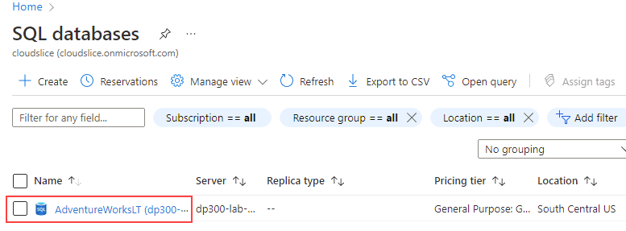
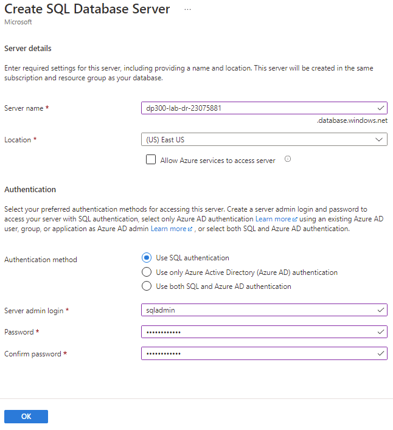
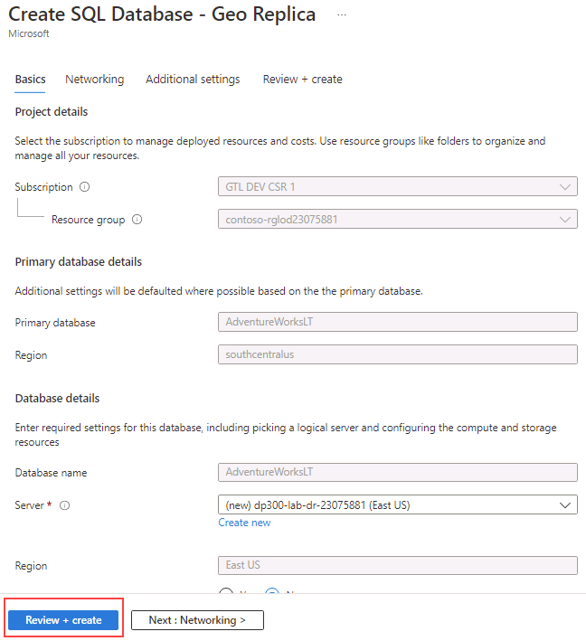
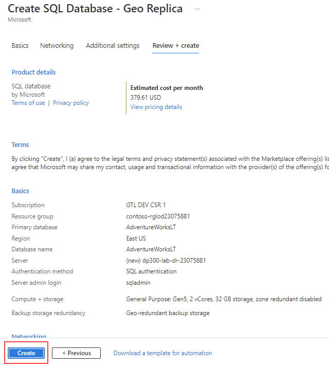
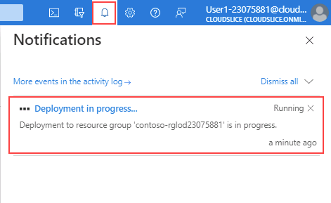
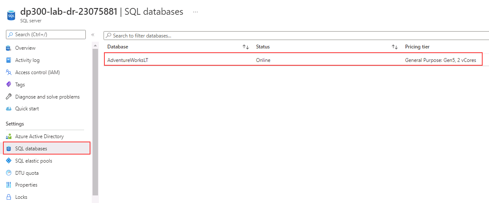

# Configure geo replication for Azure SQL Database

**Estimated Time: 30 minutes**

As a DBA within AdventureWorks, you need to enable geo-replication for Azure SQL Database, and ensure it is working properly. Additionally, you will manually fail it over to another region using the portal.

## Enable geo-replication

1. From the lab virtual machine, start a browser session and navigate to [https://portal.azure.com](https://portal.azure.com/). Connect to the Portal using the Azure **Username** and **Password** provided on the **Resources** tab for this lab virtual machine.

    

1. In the Azure portal, navigate to your database by searching for **sql databases**.

    

1. Select the SQL database **AdventureWorksLT**.

    

1. On the blade for the database, in **Data management** section, select **Replicas**.

    

1. Select **+ Create replica**.

    

1. On the **Create SQL Database - Geo Replica** page and under **Server**, select the **Create New** link.

    

    >[!NOTE]
    > As we are creating a new server to host our secondary database, we can ignore the error message above.

1. On the **Create SQL Database Server** page, enter a unique **server name** of your preference, a valid **server admin login**, and a secure **password**. Select a **location** as the target region, and then select **OK** to create the server.

    

1. Back in to the **Create SQL Database - Geo Replica** page, select **Review + Create**.

    

1. Select **Create**.

    

1. The secondary server and the database will now be created. To check the status, look under the notification icon at the top of the portal. 

    

1. If successful, it will progress from **Deployment in progress** to **Deployment succeeded**.

    

## Failover SQL Database to a secondary region

Now that the Azure SQL Database replica is created, you will perform a failover.

1. Navigate to the SQL servers page, and notice the new server in the list. Select the secondary server (you may have a different server name).

    

1. On the blade for the SQL server, in **Settings** section, select **SQL databases**.

    

1. On the SQL database main blade, in **Data management** section, select **Replicas**.

    

1. Note that the geo replication link is now established.

    

1. Select the **...** menu for the secondary server, and select **Forced Failover**.

    

    > [!NOTE]
    > Forced failover will switch the secondary database to the primary role. All sessions are disconnected during this operation.

1. When prompted by the warning message, click **Yes**.

    

1. The status of the primary replica will switch to **Pending** and the secondary to **Failover**. 

    

    > [!NOTE]
    > This process can take a few minutes. When complete, the roles will switch with the secondary becoming the new primary, and the old primary the secondary.

We've seen the readable secondary database may be in the same Azure region as the primary, or, more commonly, in a different region. This kind of readable secondary databases are also known as geo-secondaries, or geo-replicas.

You have now seen how to enable geo-replicas for Azure SQL Database, and manually fail it over to another region using the portal.
